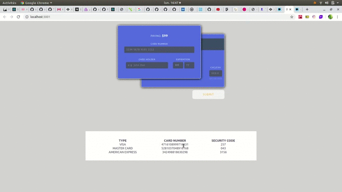

### Payment Card React template 

## Janvier 2020


[Demo](#demo)

-  [Movie](#movie-demo)


[Author](#author)

[License](#license)

[Start Project](#Start-project)

---
## Demo
---
### Movie Demo



---
 

## Tech Stack

 **You must have at minimun these versions for greats performances and good compatibility**

 **Version of Node js**
-    v8.16.2 minimun

---  

## Author 

- Rodolphe Augusto 

--- 

## License  

- MIT.

---

## Start project
---

- Clone or download this repo https://github.com/rodolphe37/payment-card-react.git

- To install node doing in the console :
  
  ``` nvm use ```

 Then, do in the console :
 
-  ``` $ cd payment-card-react```

-  ```  $ npm i``` or ``` $ npm install ```

to install the dependencies and

-  ``` $ npm start```

to start project.

  

enjoy!!!
